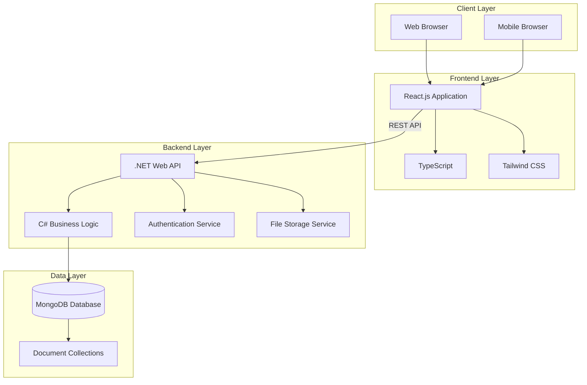
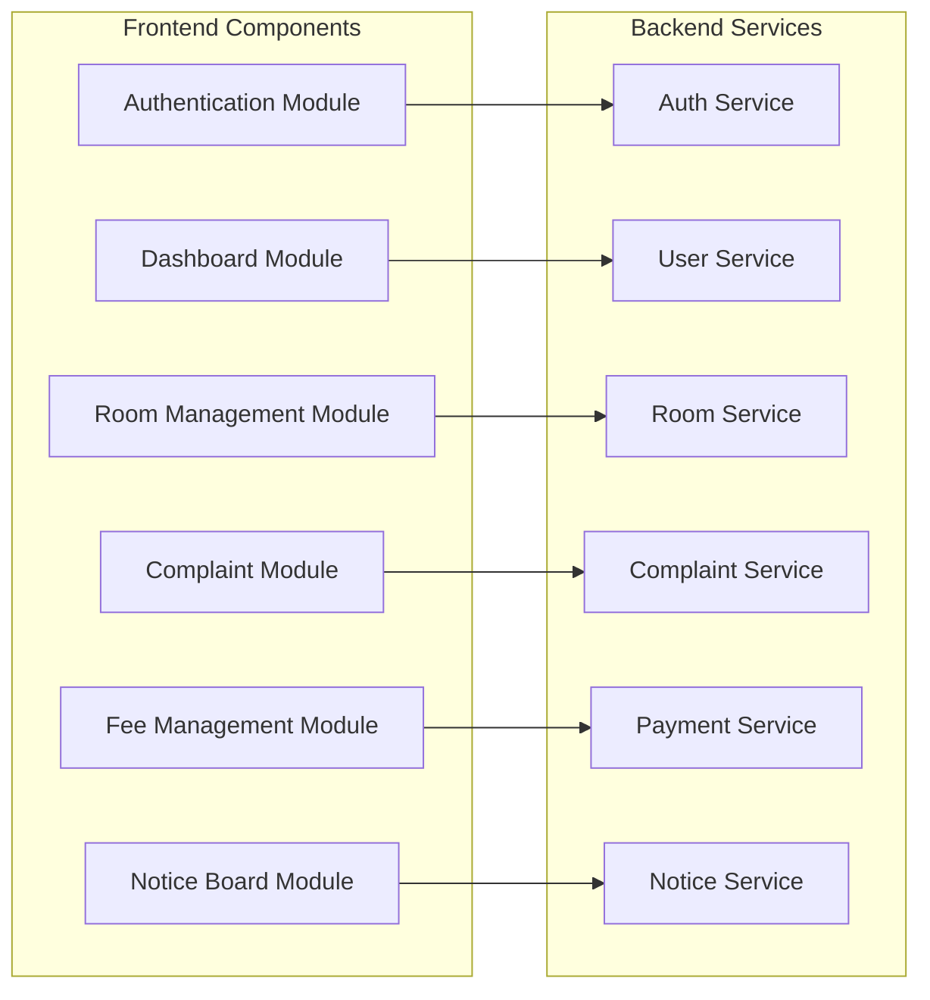
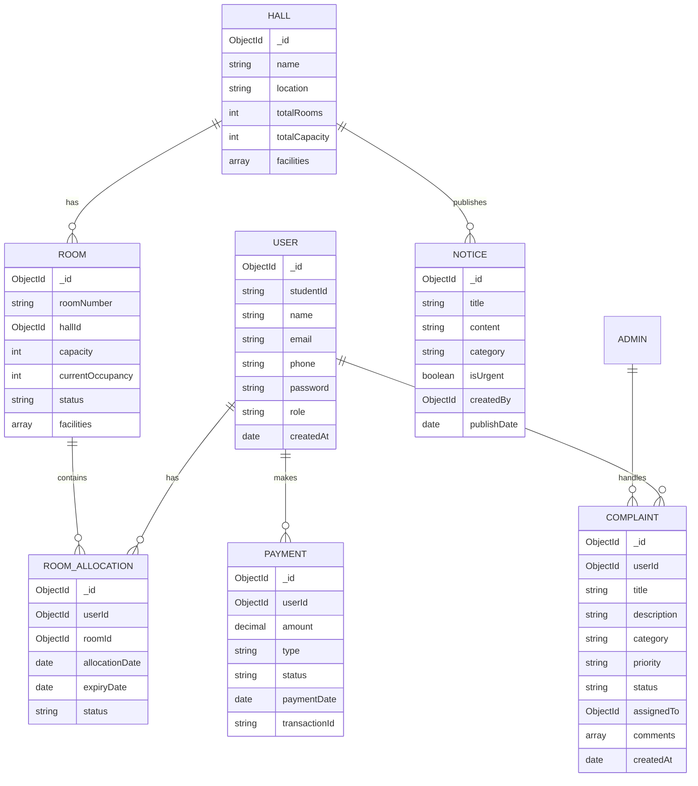
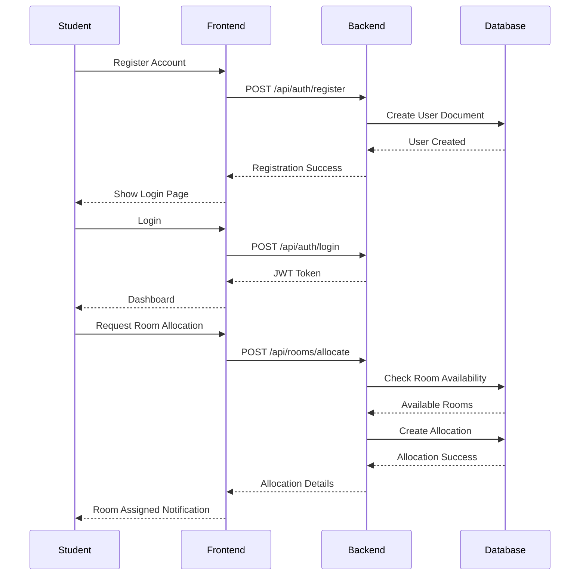
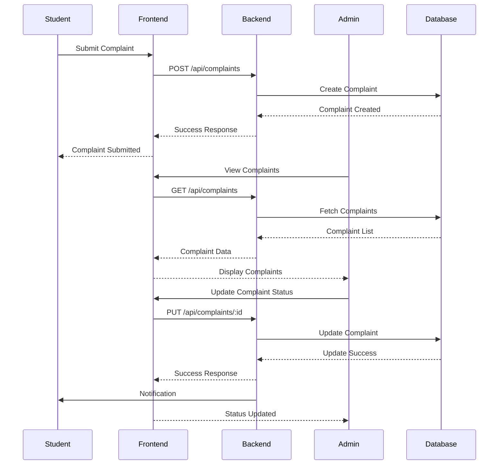

# CUET Hall Management System

<div align="center">

*A comprehensive digital solution for modernizing university hall management*

</div>

---

## 📋 Table of Contents
- [About](#about)
- [System Architecture](#system-architecture)
- [Features](#features)
- [Database Schema](#database-schema)
- [User Flows](#user-flows)
- [Installation](#installation)
- [Project Structure](#project-structure)
- [API Documentation](#api-documentation)
- [Tools & Technologies](#tools--technologies)
- [Future Roadmap](#future-roadmap)
- [Contributing](#contributing)
- [License](#license)

---

## 🎯 About

The CUET Hall Management System is a robust, full-stack solution designed to digitalize and streamline hall management processes at the Chittagong University of Engineering and Technology (CUET). The system centralizes operations like room allocation, student registration, fee management, and complaint tracking into a unified platform.

### Key Benefits
- ✅ **Efficiency**: Reduce manual intervention by 80%
- ✅ **Transparency**: Real-time tracking of all operations
- ✅ **Accessibility**: 24/7 access from any device
- ✅ **Security**: Role-based access control and data encryption
- ✅ **Scalability**: Designed to handle multiple halls and thousands of students

---

## 🏗️ System Architecture

### High-Level Architecture



### Component Architecture



---

## ✨ Features

### 🔐 User Authentication & Authorization
- Secure login/logout with JWT tokens
- Role-based access control (Student, Hall Admin, Super Admin)
- Password encryption and recovery
- Session management

### 🏠 Room Allocation Management
- Automated room assignment based on availability
- Real-time occupancy tracking
- Room transfer requests
- Vacancy notifications
- Room history and audit trail

### 📢 Complaint Management System
- Online complaint submission with categories
- Real-time status tracking (Pending, In Progress, Resolved)
- Priority-based complaint handling
- Comment and update notifications
- Complaint history and analytics

### 💰 Fee Management
- Digital tracking of hall fees and dining fees
- Payment status monitoring
- Payment history and receipts
- Due date reminders
- Fine calculation for late payments

### 📰 Notice Board
- Publish and distribute hall-related notices
- Category-based notice filtering
- Urgent notice highlighting
- Notice archive and search

### 📊 Reporting & Analytics
- Occupancy reports
- Complaint resolution analytics
- Financial summaries
- Student attendance tracking
- Custom report generation

---

## 🗄️ Database Schema

### Entity Relationship Overview



---

## 👥 User Flows

### Student Registration & Room Allocation Flow



### Complaint Submission & Resolution Flow



---

## 🚀 Installation

### Prerequisites
- **Node.js** (v16 or higher)
- **npm** or **yarn**
- **.NET SDK** (v6.0 or higher)
- **MongoDB** (v5.0 or higher)
- **Git**

### Step 1: Clone the Repository
```bash
git clone https://github.com/SM-Shaan/CuetHallManagement.git
cd CuetHallManagement
```

### Step 2: Frontend Setup
```bash
# Install dependencies
npm install

# Create .env file for environment variables
# Copy .env.example to .env and configure
cp .env.example .env
```

### Step 3: Configure Backend Domain
Edit `constants/domain.ts` to set your backend API URL:
```typescript
export const API_BASE_URL = 'http://localhost:5000/api';
```

### Step 4: Backend Setup
```bash
# Navigate to backend directory (if separate)
cd backend

# Restore NuGet packages
dotnet restore

# Update database connection string in appsettings.json
# Configure MongoDB connection string
```

### Step 5: Database Setup
```bash
# Ensure MongoDB is running
# Default connection: mongodb://localhost:27017

# The application will create collections automatically on first run
```

### Step 6: Run the Application

**Development Mode:**
```bash
# Frontend (from root directory)
npm run dev

# Backend (from backend directory)
dotnet run
```

**Production Build:**
```bash
# Frontend
npm run build
npm run preview

# Backend
dotnet publish -c Release
```

The application should now be running at:
- Frontend: `http://localhost:5173`
- Backend API: `http://localhost:5000`

---

## 📁 Project Structure

```
CuetHallManagement/
├── src/
│   ├── components/         # Reusable React components
│   │   ├── auth/          # Authentication components
│   │   ├── dashboard/     # Dashboard components
│   │   ├── rooms/         # Room management components
│   │   ├── complaints/    # Complaint system components
│   │   ├── payments/      # Payment components
│   │   └── common/        # Shared components
│   ├── pages/             # Page components
│   ├── services/          # API service functions
│   ├── hooks/             # Custom React hooks
│   ├── utils/             # Utility functions
│   ├── types/             # TypeScript type definitions
│   ├── constants/         # Constants and configurations
│   ├── styles/            # Global styles
│   └── App.tsx            # Main application component
├── backend/               # .NET Backend (if in same repo)
│   ├── Controllers/       # API Controllers
│   ├── Models/           # Data models
│   ├── Services/         # Business logic
│   ├── Data/             # Database context
│   └── Program.cs        # Entry point
├── public/               # Static assets
├── tests/                # Test files
├── package.json          # Dependencies
├── tsconfig.json         # TypeScript configuration
├── tailwind.config.js    # Tailwind CSS configuration
├── vite.config.ts        # Vite configuration
└── README.md            # This file
```

---

## 📡 API Documentation

### Authentication Endpoints
```
POST   /api/auth/register      - Register new user
POST   /api/auth/login         - User login
POST   /api/auth/logout        - User logout
GET    /api/auth/profile       - Get user profile
PUT    /api/auth/profile       - Update profile
POST   /api/auth/forgot        - Password recovery
```

### Room Management Endpoints
```
GET    /api/rooms              - List all rooms
GET    /api/rooms/:id          - Get room details
POST   /api/rooms              - Create new room (Admin)
PUT    /api/rooms/:id          - Update room (Admin)
DELETE /api/rooms/:id          - Delete room (Admin)
POST   /api/rooms/allocate     - Allocate room to student
GET    /api/rooms/available    - Get available rooms
```

### Complaint Endpoints
```
GET    /api/complaints         - List complaints
GET    /api/complaints/:id     - Get complaint details
POST   /api/complaints         - Create complaint
PUT    /api/complaints/:id     - Update complaint status
DELETE /api/complaints/:id     - Delete complaint
POST   /api/complaints/:id/comment - Add comment
```

### Payment Endpoints
```
GET    /api/payments           - List payments
GET    /api/payments/:id       - Get payment details
POST   /api/payments           - Create payment
PUT    /api/payments/:id       - Update payment status
GET    /api/payments/pending   - Get pending payments
```

### Notice Endpoints
```
GET    /api/notices            - List all notices
GET    /api/notices/:id        - Get notice details
POST   /api/notices            - Create notice (Admin)
PUT    /api/notices/:id        - Update notice (Admin)
DELETE /api/notices/:id        - Delete notice (Admin)
```

---

## 🛠️ Tools & Technologies

### Frontend Stack
- **React.js** - UI library for building interactive interfaces
- **TypeScript** - Type-safe JavaScript
- **Vite** - Fast build tool and dev server
- **Tailwind CSS** - Utility-first CSS framework
- **React Router** - Client-side routing
- **Axios** - HTTP client for API requests
- **React Query** - Data fetching and caching
- **Zustand/Context API** - State management

### Backend Stack
- **.NET 6/7 Web API** - RESTful API framework
- **C#** - Primary programming language
- **Entity Framework Core** - ORM (if needed for relational data)
- **JWT Authentication** - Secure token-based auth
- **AutoMapper** - Object-to-object mapping
- **Swagger/OpenAPI** - API documentation

### Database
- **MongoDB** - NoSQL document database
- **MongoDB.Driver** - Official .NET driver
- **MongoDB Compass** - Database GUI (development)

### Development Tools
- **Git** - Version control
- **ESLint** - Code linting
- **Prettier** - Code formatting
- **Postman** - API testing
- **VS Code** - Code editor

---

## 🔮 Future Roadmap

### Phase 1: Machine Learning Integration
- **Dynamic Fee Optimization**: ML algorithms to adjust fees based on:
  - Historical usage patterns
  - Seasonal variations
  - Resource consumption analytics
  - Predictive demand modeling

### Phase 2: Advanced Features
- **Mobile Application**: Native iOS and Android apps
- **Smart Notifications**: Push notifications for important updates
- **Biometric Authentication**: Fingerprint/face recognition
- **QR Code Integration**: Room access and payment verification
- **Chatbot Support**: AI-powered help desk

### Phase 3: Analytics & Insights
- **Predictive Analytics**: Forecast room occupancy and resource needs
- **Student Behavior Analysis**: Dining patterns and facility usage
- **Complaint Pattern Recognition**: Identify recurring issues
- **Financial Forecasting**: Budget planning and cost optimization

### Phase 4: IoT Integration
- **Smart Room Monitoring**: IoT sensors for occupancy and utilities
- **Automated Maintenance Alerts**: Proactive issue detection
- **Energy Management**: Optimize electricity and water usage
- **Digital Access Control**: Smart locks and entry systems

---

## 🤝 Contributing

We welcome contributions from the community! Here's how you can help:

### Getting Started
1. Fork the repository
2. Create a feature branch (`git checkout -b feature/AmazingFeature`)
3. Commit your changes (`git commit -m 'Add some AmazingFeature'`)
4. Push to the branch (`git push origin feature/AmazingFeature`)
5. Open a Pull Request

### Coding Standards
- Follow TypeScript best practices
- Use meaningful variable and function names
- Write comments for complex logic
- Ensure all tests pass before submitting PR
- Follow the existing code style

### Reporting Issues
- Use the GitHub issue tracker
- Provide detailed description of the bug
- Include steps to reproduce
- Add screenshots if applicable

---

## 📄 License

This project is licensed under the MIT License - see the [LICENSE](LICENSE) file for details.

---

## 👨‍💻 Authors & Contributors

- **SM Shaan** - *Initial work* - [@SM-Shaan](https://github.com/SM-Shaan)

See also the list of [contributors](https://github.com/SM-Shaan/CuetHallManagement/contributors) who participated in this project.

---

## 📞 Support & Contact

For support, questions, or feedback:
- Create an issue in the [GitHub repository](https://github.com/SM-Shaan/CuetHallManagement/issues)
- Contact the development team

---

## 🙏 Acknowledgments

- Chittagong University of Engineering and Technology (CUET)
- All contributors and testers
- Open source community for amazing tools and libraries

---

<div align="center">

**⭐ Star this repository if you find it helpful!**

*Made with ❤️ for CUET Community*

</div>

